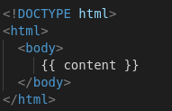
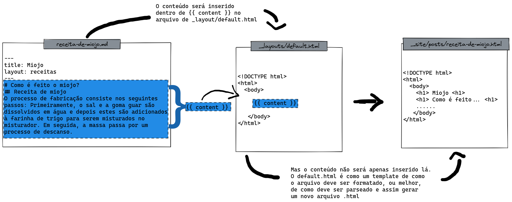

Aqui, vou explicar como fazer a instalação do seu futuro site pessoal. 

# Requisitos

O Sistema Operacional, não é um requisito, é mais um aviso:

> Tudo foi feito em um Linux baseado em Ubuntu, o mesmo pode ser reproduzido em qualquer distribuição Linux, e também em máquina virtual.
{: .prompt-warning}

Minha distro é a seguinte:
```
DISTRIB_ID=Pop
DISTRIB_RELEASE=22.04
DISTRIB_CODENAME=jammy
DISTRIB_DESCRIPTION="Pop!_OS 22.04 LTS"
```

Qualquer outra distribuição pode ser usada sem problemas, desde que tenha comandos equivalentes, com o mesmo efeito.

Também recomendo que tenha conhecimento básico em git e github, ou no mínimo, saiba fazer um fork pela interface web do github e conheça os comandos abaixo:
```
git clone
git status
git commit 
git add
git pull
git push
```

Caso não conheça:
- [Vídeo rápido da Rafaella Ballerini](https://www.youtube.com/watch?v=DqTITcMq68k)
- [Playlist detalhada do Curso em Vídeo](https://www.youtube.com/playlist?list=PLHz_AreHm4dm7ZULPAmadvNhH6vk9oNZA)

# Instalação TLTR - Too lazy to read

Se não estiver afim de ler toda a teoria pode pular para [Instalação](#instalação), ou execute os comandos abaixo:

```
sudo apt-get install ruby-full build-essential zlib1g-dev
echo '# Install Ruby Gems to ~/gems' >> ~/.bashrc
echo 'export GEM_HOME="$HOME/gems"' >> ~/.bashrc
echo 'export PATH="$HOME/gems/bin:$PATH"' >> ~/.bashrc
source ~/.bashrc
gh repo clone SEU-USERNAME/SEU-USERNAME.github.io
git clone https://github.com/SEU-USERNAME/SEU-USERNAME.github.io.git
bundle install
```

# Abordagem 

Primeiro apresento o conceito, para que mesmo que não deseje seguir usando o mesmo tema que eu, ainda assim, consiga seguir seu próprio caminho, customizando a sua maneira.

Eu poderia seguir só mostrando como instalar as parada sem explicar nada, que é o que os tutoriais gringos fazem. Mas o fato é que as documentações e vídeos de teóricos já estão todos na língua deles, então vou tentar desenvolver também alguns pontos da teoria que acho importante conhecer. Tem coisa que eu só traduzi da documentação oficial. 

Não é preciso decorar nem aprender tudo só leia os conceitos com calma e tudo vai fazer sentido no final.

*Certamente não sou a melhor pessoa para falar sobre frontend web, mas como não achei esse conteúdo em português, vale a pena tentar!* 

# Introdução ao Jekyll
Jekyll é um framework (tecnicamente falando, é uma engine de parsing) usado para transformar arquivos de texto em páginas estáticas para o seu website pessoal! 

Ou seja, há por meio dele podemos escrever e compartilhar, por meio do seu próprio site, sem precisar se aprofundar em HTML e CSS. Mas antes de chegar nessa parte vamos entender os componentes do Jekyll.

> Tem uma [playlist no youtube](https://youtube.com/playlist?list=PLLAZ4kZ9dFpOPV5C5Ay0pHaa0RJFhcmcB) com vídeos curtos sobre o Jekyll, mas está em inglês. 
{: .prompt-info }

Na essência, ele usa 3 arquivos:
```
.
├── _config.yml
├── _layouts
│   └── default.html
└── index.md
```
Imagine-os com o seguinte conteúdo:

- O `config.yml` é o arquivo com as principais configurações que o Jekyll usa para criar o site. Um arquivo vazio, usa as configurações padrões.
    ```
    name: My Jekyll Website
    ```
- O arquivo `index.md` é de conteúdo. O Jekyll procura por aquivos com as tags `---` (chamadas tags front-matter) para processar o conteúdo, preencher as variáveis, e converter o conteúdo em HTML. Veja o exemplo de como poderia ser o `index.md`:
    ```markdown
    ---
    title: Titulo
    layout: default
    ---
    
    conteúdo lalalalala
    1. Lista
    2. Numerada
    
    - Lista 
    - Normal
    ```


- Tudo que vem após os 3 últimos traços `---` será considerado conteúdo da postagem. Esse conteúdo será formatado pelo seguinte arquivo `default.html`.

{: .center }
_Exemplo de arquivo html usado para definição de layout_

- Em que, `{{ content }}`, será justamente preenchido pelo conteúdo do arquivo `index.md`. E dessa forma nosso arquivo que antes era só texto, agora se tornou um `.html` perfeitamente formatado.
- Esse arquivo novo, `.html` será criado dentro de `_site` um diretório que também será criado na execução.

Veja o esquema a seguir (clique para melhor visualização):

_Exemplo de como o documento de texto se torna uma página html_

## Gems
Gems são basicamente códigos, programas ou funcionalidades escritos na linguagem Ruby, que vem por meio dos pacotes Gems. Os pacotes gem podem desempenhar funcionalidades como:
- Conversão de objetos ruby para arquivo JSON;
- Paginação;
- Interagir com APIs como a do GitHub.

Jekyll é um gem, os plugins Jekyll e o tema que usaremos também são gems. 

O `Gemfile` é um arquivo que contém uma lista de gems usados pelo site. 

> NAO instale pacotes Ruby Gems (chamados de gems) ao longo deste tutorial, a menos que você saiba o que está fazendo. Acredita em mim, vai dar bigode se fizer isso. “Se tem placa tem história” - Sócrates 
{: .prompt-danger }

# Instalação
Primeiro siga as instruções de instalação do [Jekyll](https://jekyllrb.com/docs/installation/) a seguir para **Linux Ubuntu**:

```shell
sudo apt-get install ruby-full build-essential zlib1g-dev
```

A documentação do Jekyll também tem instruções para cada SO, caso precise:
- [macOS](https://jekyllrb.com/docs/installation/macos/)
- [Ubuntu](https://jekyllrb.com/docs/installation/ubuntu/)
- [Other Linux](https://jekyllrb.com/docs/installation/other-linux/)
- [Windows](https://jekyllrb.com/docs/installation/windows/)


Configure um diretório de instalação do gem para sua conta de usuário. Os comandos a seguir adicionarão variáveis de ambiente ao seu arquivo `~/.bashrc`{: .filepath} para configurar o caminho de instalação da gem, caso use outro shell, basta substituir o bashrc pelo arquivo que o seu shell usa.
Caso não faça a mínima ideia do que é isso de bashrc consulte o [anexo 1](#anexo-1-bashrc) que tem uma explicação rápida sobre ele.
Bom, seguindo em frente:

```shell
echo '# Install Ruby Gems to ~/gems' >> ~/.bashrc
echo 'export GEM_HOME="$HOME/gems"' >> ~/.bashrc
echo 'export PATH="$HOME/gems/bin:$PATH"' >> ~/.bashrc
source ~/.bashrc
```

## Instalação do Tema
Existem diversos temas que mudam a aparencia do seu site. O que eu escolhi foi o [Chirpy](https://chirpy.cotes.page/posts/getting-started/), cuidado pois podem haver diferenças caso escolha outro tema.

Existem duas formas de instalar usar o Chirpy, eu seguirei com a mais fácil que é usando o [template](https://github.com/cotes2020/chirpy-starter/) basta clicar em <kbd>Use this template</kbd> > <kbd>Create a new repository</kbd>, e nomeie o repositório como `SEU-USERNAME.github.io`, em que, `SEU-USERNAME` é o seu nome de usuário do github.

Agora entre no seu repositório criado e na aba <kbd>Settings</kbd> depois clique em <kbd>Pages</kbd> e abaixo de <kbd>Build and deployment</kbd> selecione <kbd>Github Actions</kbd>. E é por meio dessas configurações que o nossa página será implementada. 

Faça o clone do seu repositório da maneira que preferir. Dois exemplos:
```shell
gh repo clone SEU-USERNAME/SEU-USERNAME.github.io
git clone https://github.com/SEU-USERNAME/SEU-USERNAME.github.io.git
```

Com o repositório, podemos seguir com a instalação dos gems necessários:
```shell
bundle install 
```

Feita a instalação, agora é só executar `bundle exec jekyll serve -l -w --port 4000` e acessar a página em 127.0.0.1:4000.

Para configuração, confira o post de configuração do jekyll (em breve).

# Anexo 1 bashrc

O shell é basicamente uma interface de acesso ao sistema base. 
O Bash é o interpretador de comandos de shell (o seu pode ser outro).
Use com comando `echo $SHELL` para saber qual é o seu:
```
> echo $SHELL
/usr/bin/zsh
```
{: file='exemplo de output'}

O meu é o interpretador shell é o `zsh` .

É bom saber também que ao logar no Linux vários arquivos sao carregados para saber suas configurações pessoais e carrega-las, um desses arquivos é o tal do `bashrc` ou `zshrc` , por isso temos que adicionar aquelas linhas a esses arquivos, para que carreguem as nossa preferências e configurações do ruby.

```shell
echo '# Install Ruby Gems to ~/gems' >> ~/.zshrc
echo 'export GEM_HOME="$HOME/gems"' >> ~/.zshrc
echo 'export PATH="$HOME/gems/bin:$PATH"' >> ~/.zshrc
source ~/.zshrc
```

# Ref.

CHUNG, C. Getting Started. Disponível em: <https://chirpy.cotes.page/posts/getting-started/>. Acesso em: 24 fev. 2023.

COSTA, M. Usando Jekyll e GitHub Pages. Disponível em: <https://murilo.tech/posts/usando-jekyll-e-github-pages/>. Acesso em: 24 fev. 2023.

DOMINGUEZ, J. How Jekyll Works ; ruhoh universal static blog generator. Disponível em: <http://jekyllbootstrap.com/lessons/jekyll-introduction.html>. Acesso em: 24 fev. 2023.

JEKYLL TEAM. Command Line Usage. Disponível em: <https://jekyllrb.com/docs/usage/>. Acesso em: 24 fev. 2023.

JEKYLL TEAM. Ruby 101. Disponível em: <https://jekyllrb.com/docs/ruby-101/>. Acesso em: 24 fev. 2023.

TOMJOHT. Convert an HTML site to Jekyll. Disponível em: <https://jekyllrb.com/tutorials/convert-site-to-jekyll/>. Acesso em: 24 fev. 2023. 

*[SO]:"Sistema Operacional"