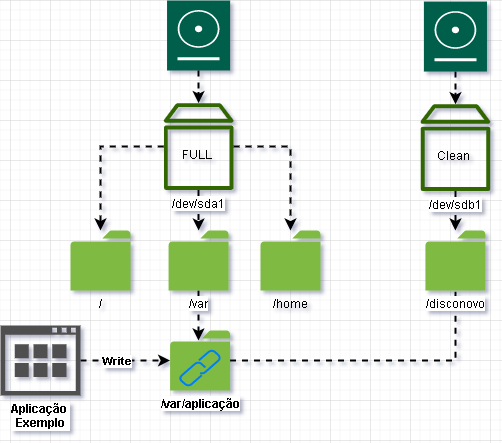
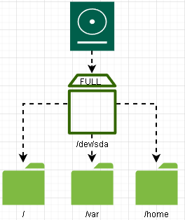
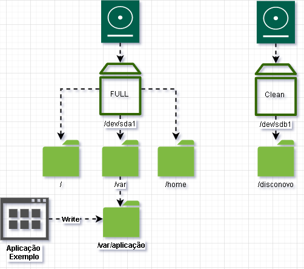

Como usar links simbólicos para aumentar o espaço em disco sem reiniciar o servidor.



<!--truncate-->

[Symbolic link - Wikipedia](https://en.wikipedia.org/wiki/Symbolic_link#Storage_of_symbolic_links)

[How to save space with-ymlinks](https://linuxconfig.org/how-to-save-space-with-symlinks-and-mount-points)

 Muitas vezes o disco fica cheio, e diante da impossibilidade de expandir a partição raiz, podemos optar pela combinação de adição de um novo disco com o uso de links simbólicos. Observe o desenho, a fim de entender a situação problema;
Num primeiro momento, você apenas sabe que sua aplicação não consegue mais escrever em arquivos, pois o disco está cheio. Bom, podemos usar o comando abaixo, para achar qual diretório está ocupando mais espaço: 

```bash
du -d 1 -cha / 2>/dev/null | grep -E 'G|M'
```

E supondo que você descobriu que o diretório era de fato da sua aplicação no `/var` , e não há como expandir o volume, nem a partição raiz configurada, diante disso, podemos fazer a sua aplicação achar que está armazenando no `/var/aplicação` , quando na verdade, esta sendo usado o espaço disponível no disco recém adicionado (referenciado na imagem, como `/dev/sdb1`).



Adicione o novo disco, monte em um diretório qualquer, pare a sua aplicação, e mova os arquivos para o novo diretório (talvez bata um medo, rsrs):

```bash
/etc/init.d/aplicação stop
mv /var/aplicação /disconovo
ln -s /disconovo/aplicação /var/
```

Agora `/var/aplicação` é apenas um link simbólico, como um atalho na sua área de trabalho.


Se você fizer `ln -s /var/aplicacao /var/link`, então `/var/link` será um arquivo que irá fazer referencia ao conteúdo de `/var/aplicacao`. Logo `ls /var/link`, tentará obter uma listagem de diretórios para `/var/link`, e o sistema devolverá uma listagem do conteúdo de `/var/aplicacao`.

O mesmo serve na hora de escrever os arquivos.
